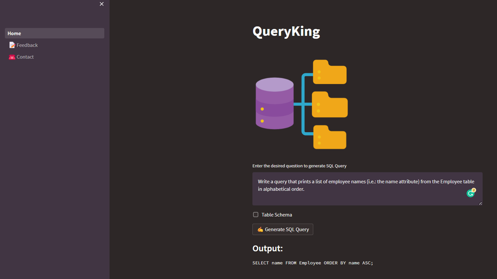

<p align = "center"></p>

A minimalistic application to generate SQL queries using Generative AI built with Python and Streamlit


## Tech Stack 💻

- 
- Streamlit
- OpenAI GPT3

## Demo 👇

**v.0.0.1** - ([HackerRank SQL : Name of Employees Problem](https://www.hackerrank.com/challenges/name-of-employees/problem))

<p align = "center"></p>


## Set-Up ⚒️

<p align = "center"></p>

- Ensure you have the latest stable version of [Python](https://www.python.org/downloads/) in your system

- Open your terminal / command prompt. 

- Clone the repository 
    ```
    git clone https://github.com/smaranjitghose/AIEmailGenerator.git
    ```
- Change the directory to the cloned project
    
    ```
    cd AIEmailGenerator
    ```

- Create a virtual environment

    ```
    python -m venv env
    ```

- Activate the virtual environment

    - Windows
        ```
         env/Scripts/Activate.ps1
        ```
    
    - Linux/Mac
        ```
        source env/bin/activate
        ```

- Check if the virtual environment in the concerned repository is used for python shell

    ```
    which python
    ```

- Upgrage `pip` package manager

    ```
    python -m pip install --upgrade pip
    ```

- Install the dependencies

    ```
    pip install -r requirements.txt
    ```

- Load the application

    ```
    streamlit run ./Home.py
    ```

- If the app does not load by itself in your default browser, open a browser of your choice and navigate to  `http://localhost:8501`

- To stop the application, press `CTRL + C` in your terminal

- To deactive the python environment, type in your terminal

    ```
    deactivate
    ```

## Acknowledgements 🙏

<p align = "center"></p>


- **Open AI GPT-3 Text Completion Model**: [OpenAI GPT3](https://openai.com) 
    - [Documentation](https://beta.openai.com/docs/)
    - [Playground](https://beta.openai.com/playground)
- **Animations**: [LottieFiles](https://lottiefiles.com)
